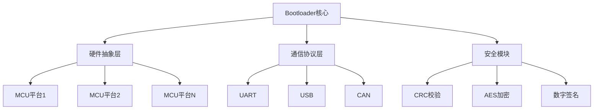
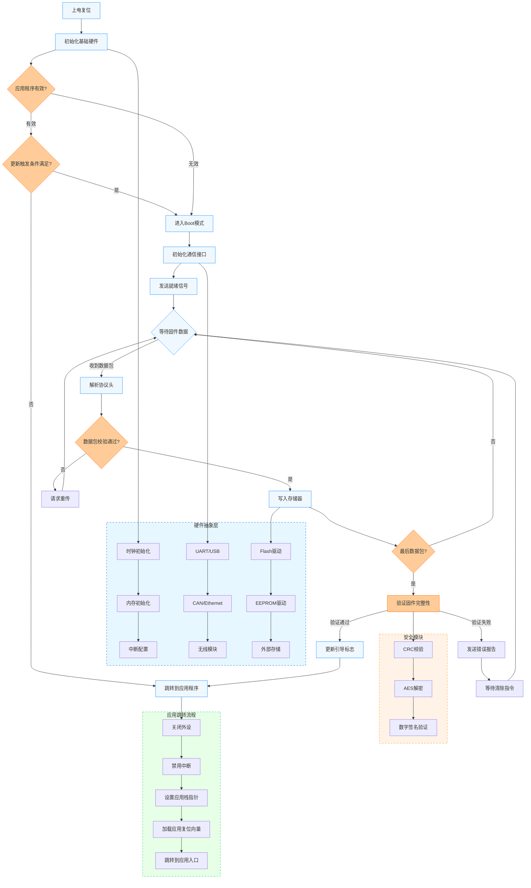

# OpenLoad

## 概述
这是一个高度可移植的通用单片机Bootloader框架，支持多种MCU架构（包括ARM Cortex-M, RISC-V, AVR, PIC等）。设计核心是**硬件抽象层(HAL)** 架构，使得同一套代码可以轻松适配不同单片机平台，无需重写核心逻辑。

## 设计特点
- **跨平台支持**：通过HAL接口实现硬件无关性
- **模块化架构**：各功能组件解耦，便于定制
- **安全机制**：支持CRC校验、AES加密和数字签名
- **多通信接口**：UART/USB/CAN/Ethernet/无线兼容
- **轻量高效**：核心代码<8KB，RAM占用<1KB
- **可靠更新**：双区备份和断电保护机制

## 系统架构



##  快速开始

### 1. 配置硬件抽象层

在`hal`目录中实现目标平台的HAL接口：

```c
// hal_template.c
void hal_init(void) {
    // 初始化时钟、内存、中断
}

int hal_flash_write(uint32_t addr, const uint8_t *data, uint32_t len) {
    // 实现Flash写入
}

int hal_comm_receive(uint8_t *buf, uint32_t timeout) {
    // 实现通信接口接收
}
```

### 2. 配置内存布局

修改`boot_config.h`:

```c
// STM32F4示例配置
#define APP_START_ADDR     0x08008000
#define FLASH_PAGE_SIZE    0x2000       // 16KB页
#define RAM_SIZE           0x20000      // 128KB RAM
#define BOOTLOADER_SIZE    0x8000       // 32KB Bootloader
```

### 3. 选择通信协议

在`protocols`目录中选择或实现通信协议：

```c
// protocols/xmodem.c
const Protocol xmodem_protocol = {
    .init = xmodem_init,
    .receive_packet = xmodem_receive,
    .send_ack = xmodem_ack
};
```

### 4. 编译烧录


## 工作流程




## 安全特性

| 安全机制    | 功能描述             | 配置文件选项         |
| :---------- | :------------------- | :------------------- |
| CRC32校验   | 固件完整性验证       | `ENABLE_CRC_CHECK=1` |
| AES-256加密 | 固件传输加密         | `ENABLE_AES=1`       |
| ECDSA签名   | 固件来源认证         | `ENABLE_ECDSA=1`     |
| 防回滚保护  | 防止旧版本固件被安装 | `ENABLE_VERSION=1`   |
| 双区备份    | 安全更新和回退机制   | `ENABLE_DUAL_BANK=1` |


## 移植指南

1. **实现HAL接口**：
   - `hal_init()` - 硬件初始化
   - `hal_flash_*()` - Flash操作
   - `hal_comm_*()` - 通信接口
2. **配置内存布局**：
   - 在`boot_config.h`中定义应用起始地址
   - 设置Flash页大小和总容量
3. **选择通信协议**：
   - 内置支持XMODEM/YMODEM
   - 可扩展自定义协议
4. **定制安全选项**：
   - 根据需求启用安全特性
   - 配置加密密钥和证书


## 工具链支持

- **固件打包工具**：生成加密签名固件
- **Bootloader CLI**：命令行更新工具
- **QBoot助手**：图形化更新工具
- **日志分析器**：Bootloader调试工具


## 贡献指南

欢迎通过Issue和Pull Request贡献：

1. 新增MCU平台支持
2. 扩展通信协议
3. 增强安全功能
4. 优化文档和示例


## 许可证
Apache License 2.0 - 允许商业使用和修改

本项目中使用了以下第三方组件：
RT-Thread fal库
项目名称: fal
功能: 用于存储管理和分区管理
来源: 基于RT-Thread官方fal组件开发
LICENSE: RT-ThreadfalLICENSE
版权声明
本项目基于RT-Thread fal组件进行开发和优化，版权归RT-Thread所有。如需使用本项目中的fal相关功能，请遵守RT-Thread的LICENSE协议。