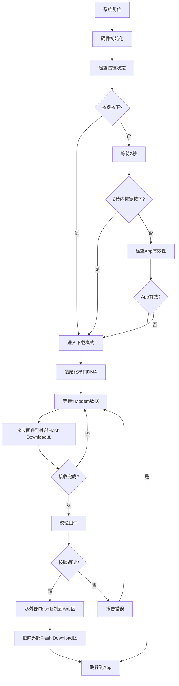

# STM32F103ZET6 通用Bootloader设计文档

## 1. 项目概述

本项目旨在开发一个通用的STM32F103ZET6 bootloader，支持Flash分区管理、外部Flash扩展、YModem协议固件下载等功能。

### 1.1 主要特性
- Flash分区管理（内部Bootloader区/App区 + 外部Download区/Backup区）
- 外部Flash支持（通过SPI）
- YModem协议固件下载
- 串口DMA + 空闲中断 + 环形缓冲区
- 按键检测启动逻辑
- 固件完整性校验

### 1.2 硬件配置
- 主控：STM32F103ZET6 (512KB Flash, 64KB RAM)
- 外部Flash：W25Q64 (8MB) 通过SPI1连接
- 串口：USART1 (PA9-TX, PA10-RX) 用于固件下载
- 按键：PA0 (低电平有效)
- LED指示：PC13 (状态指示)

## 2. Flash分区设计

### 2.1 内部Flash分区 (512KB总容量)
```
地址范围                 | 大小    | 分区名称     | 用途
0x0800 0000 - 0x0800 FFFF | 64KB   | Bootloader   | 引导程序
0x0801 0000 - 0x0807 FFFF | 448KB  | Application  | 应用程序
```

### 2.2 外部Flash分区 (8MB)
```
地址范围                 | 大小   | 分区名称      | 用途
0x0000 0000 - 0x0000 FFFF | 64KB  | Backup_Boot   | 备份引导
0x0001 0000 - 0x0001 FFFF | 64KB  | Download      | 临时下载区
0x0002 0000 - 0x007F FFFF | 8MB-128KB | Firmware_Store | 固件存储
```

## 3. 系统架构

### 3.1 模块划分
```
bootloader/
├── Core/                    # 核心系统文件
│   ├── Inc/
│   └── Src/
├── Drivers/                 # 驱动层
│   ├── CMSIS/
│   ├── STM32F1xx_HAL_Driver/
│   └── BSP/                # 板级支持包
│       ├── flash_driver.c  # 内部/外部Flash驱动
│       ├── uart_driver.c   # 串口驱动
│       └── spi_flash.c     # 外部Flash驱动
├── Middlewares/            # 中间件
│   ├── ymodem.c           # YModem协议
│   ├── ringbuffer.c       # 环形缓冲区
│   └── crc.c              # CRC校验
├── Application/            # 应用层
│   ├── bootloader.c       # 主程序逻辑
│   ├── flash_manager.c    # 内部/外部Flash分区管理
│   └── firmware_update.c  # 固件更新
└── Config/                # 配置文件
    └── bootloader_config.h
```

### 3.2 启动流程


## 4. 关键模块设计

### 4.1 Flash管理模块
```c
typedef struct {
    uint32_t start_addr;    // 起始地址
    uint32_t size;          // 分区大小
    uint32_t used_size;     // 已使用大小
    uint8_t  status;        // 分区状态
} flash_partition_t;

// Flash操作接口
int flash_init(void);
int flash_erase_partition(uint8_t partition_id);
int flash_write_data(uint32_t addr, uint8_t *data, uint32_t len);
int flash_read_data(uint32_t addr, uint8_t *data, uint32_t len);
```

### 4.2 串口DMA + 环形缓冲区
```c
typedef struct {
    uint8_t *buffer;        // 缓冲区指针
    uint32_t size;          // 缓冲区大小
    uint32_t head;          // 头指针
    uint32_t tail;          // 尾指针
} ring_buffer_t;

// 串口接收处理
void uart_dma_init(void);
void uart_idle_callback(void);
uint32_t ringbuf_read(ring_buffer_t *rb, uint8_t *data, uint32_t len);
```

### 4.3 YModem协议处理
```c
typedef struct {
    uint8_t soh;            // 帧头 0x01
    uint8_t seq;            // 序号
    uint8_t seq_inv;        // 序号取反
    uint8_t data[128];      // 数据
    uint16_t crc;           // CRC校验
} ymodem_packet_t;

// YModem接口
int ymodem_receive_init(void);
int ymodem_receive_packet(ymodem_packet_t *packet);
int ymodem_send_ack(void);
int ymodem_send_nak(void);
```

### 4.4 固件更新流程
```c
typedef struct {
    uint32_t magic;         // 魔数 0x12345678
    uint32_t version;       // 版本号
    uint32_t size;          // 固件大小
    uint32_t crc32;         // CRC32校验
    uint32_t timestamp;     // 时间戳
} firmware_header_t;

// 固件更新接口
int firmware_download(void);  // 通过YModem下载到外部Flash Download区
int firmware_verify(uint32_t addr);  // 校验外部Flash中的固件
int firmware_install(void);  // 从外部Flash Download区复制到内部App区
```

## 5. 通信协议

### 5.1 YModem协议帧格式
```
SOH + 序号 + 序号取反 + 128字节数据 + CRC16
STX + 序号 + 序号取反 + 1024字节数据 + CRC16
```

### 5.2 控制字符定义
```c
#define SOH     0x01    // 128字节数据包
#define STX     0x02    // 1024字节数据包
#define EOT     0x04    // 传输结束
#define ACK     0x06    // 确认
#define NAK     0x15    // 否认
#define CAN     0x18    // 取消
#define C       0x43    // CRC模式
```

## 6. 状态管理

### 6.1 系统状态定义
```c
typedef enum {
    BOOT_STATE_INIT,        // 初始化
    BOOT_STATE_CHECK_KEY,   // 检查按键
    BOOT_STATE_WAIT_TIMEOUT,// 等待超时
    BOOT_STATE_DOWNLOAD,    // 下载模式
    BOOT_STATE_VERIFY,      // 校验固件
    BOOT_STATE_INSTALL,     // 安装固件
    BOOT_STATE_JUMP_APP,    // 跳转应用
    BOOT_STATE_ERROR        // 错误状态
} boot_state_t;
```

### 6.2 LED状态指示
- 常亮：正常启动
- 慢闪(1Hz)：等待按键
- 快闪(5Hz)：下载模式
- 双闪：校验错误
- 三闪：跳转应用

## 7. 安全机制

### 7.1 固件完整性校验
- 每个固件包含Header信息
- CRC32校验确保数据完整性
- 版本号检查防止固件降级

### 7.2 容错机制
- 下载失败时保留原有App
- 提供固件恢复功能
- 看门狗保护防止死机

## 8. 配置参数

### 8.1 系统配置
```c
#define BOOTLOADER_VERSION      "1.0.0"
#define FIRMWARE_MAGIC          0x12345678
#define MAX_FIRMWARE_SIZE       (448 * 1024)  // 448KB
#define UART_BAUDRATE          115200
#define KEY_CHECK_TIMEOUT      2000           // 2秒
#define DOWNLOAD_TIMEOUT       30000          // 30秒
```

### 8.2 内存配置
```c
#define BOOTLOADER_START       0x08000000
#define BOOTLOADER_SIZE        (64 * 1024)
#define EXTERNAL_DOWNLOAD_START 0x00010000  // 外部Flash Download区地址
#define DOWNLOAD_SIZE          (64 * 1024)
#define APPLICATION_START      0x08010000
#define APPLICATION_SIZE       (448 * 1024)
```

## 9. 调试与测试

### 9.1 调试接口
- 串口调试输出
- LED状态指示
- 关键状态记录

### 9.2 测试用例
- 正常启动测试
- 按键检测测试
- YModem下载测试
- 固件校验测试
- 错误恢复测试

## 10. 使用说明

### 10.1 固件制作
1. 编译应用程序生成bin文件
2. 添加固件头信息
3. 计算CRC32校验值
4. 使用YModem发送工具下载

### 10.2 升级流程
1. 按住按键上电进入下载模式
2. 使用串口工具选择YModem发送
3. 选择固件文件开始传输
4. 等待传输完成自动重启

这个设计提供了一个完整、可靠的bootloader解决方案，具有良好的扩展性和维护性。