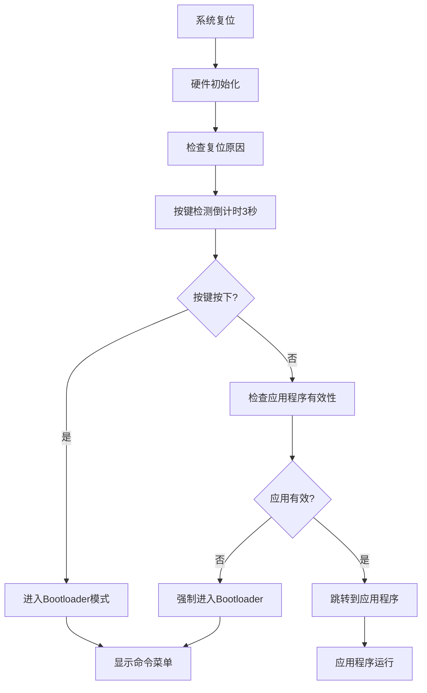

# 阶段1-2：软件架构设计

## 概述
设计STM32F103ZET6 Bootloader的软件架构，包括内存分区、程序流程和模块结构。

## 内存分区设计

### STM32F103ZET6 内部Flash分区 (512KB)
```
+------------------+ 0x08080000 (512KB)
|   配置参数区     |
|     (4KB)        | 0x0807F000-0x0807FFFF
+------------------+ 0x0807F000
|                  |
|   应用程序区     |
|    (472KB)       | 0x08008000-0x0807EFFF
|                  |
+------------------+ 0x08008000 (32KB)
|   Bootloader区   |
|     (32KB)       | 0x08000000-0x08007FFF
+------------------+ 0x08000000
```

### W25Q64 外部Flash分区 (8MB)
```
+------------------+ 0x800000 (8MB)
|   用户数据区     |
|     (4MB)        | 0x400000-0x7FFFFF
+------------------+ 0x400000
|   备份固件区     |
|     (2MB)        | 0x200000-0x3FFFFF
+------------------+ 0x200000
|   固件下载区     |
|     (2MB)        | 0x000000-0x1FFFFF
+------------------+ 0x000000
```

## 程序启动流程

### 启动状态机


### 应用程序跳转
```c
// 应用程序跳转函数原型
typedef void (*pFunction)(void);
#define APP_ADDRESS    0x08008000

void JumpToApplication(void)
{
    uint32_t JumpAddress;
    pFunction Jump_To_Application;
    
    // 检查栈顶指针有效性
    if (((*(__IO uint32_t*)APP_ADDRESS) & 0x2FFE0000 ) == 0x20000000)
    {
        JumpAddress = *(__IO uint32_t*) (APP_ADDRESS + 4);
        Jump_To_Application = (pFunction) JumpAddress;
        
        // 重设主栈指针
        __set_MSP(*(__IO uint32_t*) APP_ADDRESS);
        
        // 跳转到应用程序
        Jump_To_Application();
    }
}
```

## 软件模块架构

### 分层架构设计
```
+----------------------+
|    应用层 (App)      |
|  - 命令解析器        |
|  - 菜单系统          |
|  - 状态管理          |
+----------------------+
|   业务层 (Service)   |
|  - IAP管理器         |
|  - OTA管理器         |
|  - 固件管理器        |
+----------------------+
|   驱动层 (Driver)    |
|  - UART驱动          |
|  - SPI驱动           |
|  - Flash驱动         |
+----------------------+
|   硬件层 (HAL)       |
|  - 时钟配置          |
|  - GPIO控制          |
|  - 中断管理          |
+----------------------+
```

### 核心模块定义

#### 1. 系统管理模块 (System)
- **system_init.c**：系统初始化
- **system_clock.c**：时钟配置
- **system_reset.c**：复位管理
- **system_jump.c**：应用跳转

#### 2. 硬件驱动模块 (Drivers)
- **uart_driver.c**：串口驱动
- **spi_driver.c**：SPI驱动
- **gpio_driver.c**：GPIO驱动
- **timer_driver.c**：定时器驱动

#### 3. Flash管理模块 (Flash)
- **internal_flash.c**：内部Flash操作
- **w25q64_driver.c**：W25Q64驱动
- **flash_manager.c**：Flash分区管理
- **flash_verify.c**：校验功能

#### 4. 通信协议模块 (Protocol)
- **uart_protocol.c**：串口通信协议
- **esp8266_at.c**：ESP8266 AT指令
- **http_client.c**：HTTP客户端
- **packet_parser.c**：数据包解析

#### 5. 应用功能模块 (Application)
- **command_parser.c**：命令解析器
- **menu_system.c**：菜单系统
- **iap_manager.c**：IAP管理器
- **ota_manager.c**：OTA管理器

## 数据结构定义

### 固件信息结构
```c
typedef struct {
    uint32_t magic;         // 魔术字：0xDEADBEEF
    uint32_t version;       // 版本号
    uint32_t size;          // 固件大小
    uint32_t crc32;         // CRC32校验
    uint32_t timestamp;     // 时间戳
    char description[32];   // 描述信息
} firmware_header_t;
```

### 系统配置结构
```c
typedef struct {
    uint32_t magic;         // 配置魔术字：0x12345678
    uint8_t auto_boot;      // 自动启动标志
    uint8_t boot_delay;     // 启动延时（秒）
    uint8_t uart_baudrate;  // 串口波特率索引
    uint8_t wifi_enable;    // WiFi使能标志
    char wifi_ssid[32];     // WiFi SSID
    char wifi_password[32]; // WiFi密码
    char ota_url[128];      // OTA服务器URL
    uint32_t crc32;         // 配置CRC32
} bootloader_config_t;
```

### IAP数据包结构
```c
typedef struct {
    uint8_t header;         // 包头：0xAA
    uint8_t cmd;            // 命令类型
    uint16_t length;        // 数据长度
    uint8_t data[256];      // 数据载荷
    uint8_t checksum;       // 校验和
    uint8_t footer;         // 包尾：0x55
} iap_packet_t;
```

## 中断向量表重定位

### Bootloader中断向量表
```c
// 在startup_stm32f103xe.s中定义
__Vectors       DCD     __initial_sp        ; Top of Stack
                DCD     Reset_Handler       ; Reset Handler
                DCD     NMI_Handler         ; NMI Handler
                DCD     HardFault_Handler   ; Hard Fault Handler
                // ... 其他中断向量
```

### 应用程序中断向量表重定位
```c
// 在应用程序中设置向量表基址
void RelocateVectorTable(void)
{
    SCB->VTOR = APP_ADDRESS;
}
```

## 状态管理机制

### 启动状态定义
```c
typedef enum {
    BOOT_STATE_INIT = 0,
    BOOT_STATE_KEY_DETECT,
    BOOT_STATE_APP_CHECK,
    BOOT_STATE_APP_JUMP,
    BOOT_STATE_BOOTLOADER,
    BOOT_STATE_IAP_MODE,
    BOOT_STATE_OTA_MODE,
    BOOT_STATE_ERROR
} boot_state_t;
```

### 状态转换表
```c
typedef struct {
    boot_state_t current_state;
    uint32_t event;
    boot_state_t next_state;
    void (*action)(void);
} state_transition_t;
```

## 错误处理机制

### 错误代码定义
```c
typedef enum {
    ERR_OK = 0,
    ERR_INVALID_PARAM,
    ERR_FLASH_WRITE_FAIL,
    ERR_FLASH_ERASE_FAIL,
    ERR_CRC_CHECK_FAIL,
    ERR_TIMEOUT,
    ERR_COMM_FAIL,
    ERR_UNKNOWN
} error_code_t;
```

### 异常恢复策略
1. **Flash操作失败**：重试3次，失败后报错
2. **通信超时**：清空缓冲区，重新开始
3. **校验失败**：回滚到备份固件
4. **系统异常**：记录错误信息，软件复位

## 编译配置

### 内存配置 (STM32F103ZE_Flash.icf)
```
define symbol __ICFEDIT_intvec_start__ = 0x08000000;
define symbol __ICFEDIT_region_ROM_start__ = 0x08000000;
define symbol __ICFEDIT_region_ROM_end__   = 0x08007FFF;
define symbol __ICFEDIT_region_RAM_start__ = 0x20000000;
define symbol __ICFEDIT_region_RAM_end__   = 0x2000FFFF;
```

### 编译宏定义
```c
#define BOOTLOADER_VERSION      0x01000000
#define APP_START_ADDRESS       0x08008000
#define CONFIG_START_ADDRESS    0x0807F000
#define EXTERNAL_FLASH_SIZE     0x800000
#define MAX_FIRMWARE_SIZE       0x76000
```

## 性能要求

### 启动时间
- 系统初始化：< 100ms
- 按键检测：3000ms ± 50ms
- 应用跳转：< 10ms
- Bootloader启动：< 200ms

### 通信速度
- 串口IAP：115200bps，有效传输率85%
- SPI Flash：18MHz，读取速度>2MB/s
- WiFi OTA：取决于网络，目标>100KB/s

## 验证标准
1. 内存分区合理，无重叠冲突
2. 程序流程正确，状态转换无误
3. 模块接口清晰，依赖关系明确
4. 数据结构合理，内存使用高效
5. 错误处理完善，系统稳定可靠

## 下一步行动
软件架构设计完成后，开始搭建开发环境。